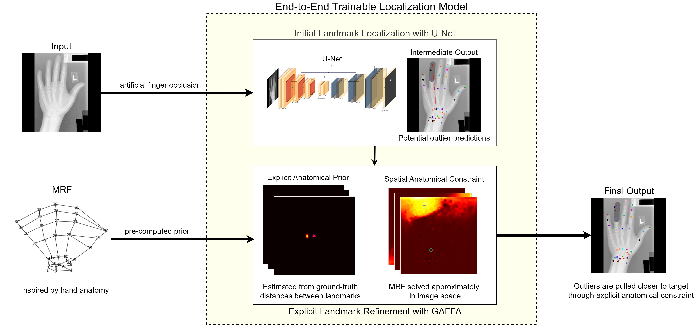

# GAFFA - Global Anatomical Feasibility Filter and Analysis



## Overview

This is the official implementation of the paper:  
**"Implicit Is Not Enough: Explicitly Enforcing Anatomical Priors inside Landmark Localization Models"**  
Published in Bioengineering ([DOI: 10.3390/bioengineering11090932](https://doi.org/10.3390/bioengineering11090932))

### Citation
If you find this work helpful, please cite our paper:
```bibtex
@Article{bioengineering11090932,
    AUTHOR    = {Joham, Simon Johannes and Hadzic, Arnela and Urschler, Martin},
    TITLE     = {Implicit Is Not Enough: Explicitly Enforcing Anatomical Priors inside Landmark Localization Models},
    JOURNAL   = {Bioengineering},
    VOLUME    = {11},
    YEAR      = {2024},
    NUMBER    = {9},
    ARTICLE-NUMBER = {932},
    PubMedID  = {39329674},
    ISSN      = {2306-5354},
    DOI       = {10.3390/bioengineering11090932}
}
```

## License

This repo incorporates [MedicalDataAugmentationTool](https://github.com/christianpayer/MedicalDataAugmentationTool/tree/master) and is therefore licensed under the GNU General Public License v3.0.

## Installation

1. **Dataset Setup**
   - Place dataset images in `datasets/xray_hand/images` (raw+mhd files)
   - Annotations are included in the repository

2. **Environment Setup**
   ```bash
   # Create conda environment with Python 3.10.14
   conda create -n GAFFA python=3.10.14
   conda activate GAFFA
   ```

3. **Dependencies**
   ```bash
   pip install -r requirements.txt
   ```

## Usage

Run the example configuration files using:
```bash
python main.py default/default_xray_hand_train_UNet+GAFFA.json
```

### Important Notes

- Conditional distribution heatmaps must be precomputed locally (default setting in configs)
- This precomputation is required even when using pretrained GAFFA models (generates a .npy file containing landmark connectivity information)
- As a PhD student, repository maintenance will be sporadic, but I will attempt to address minor questions when possible
